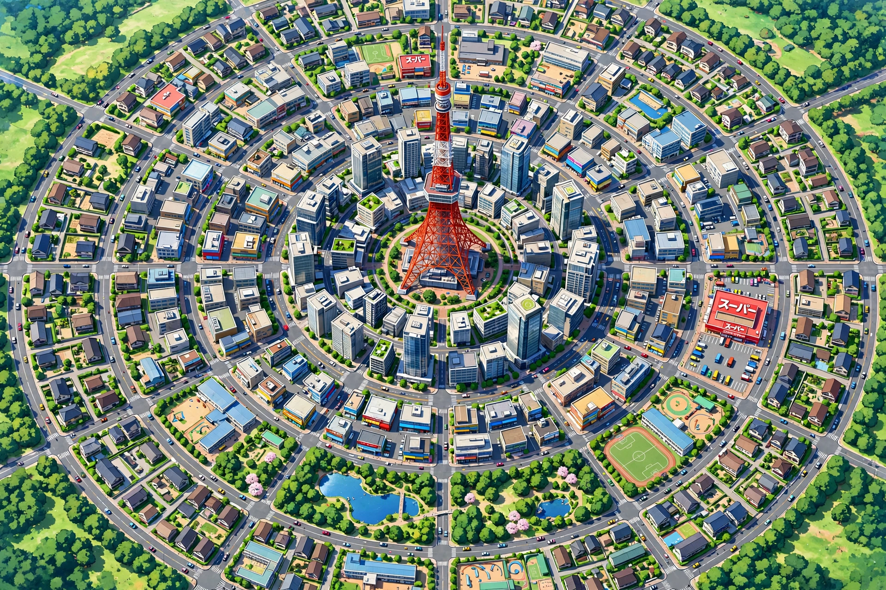
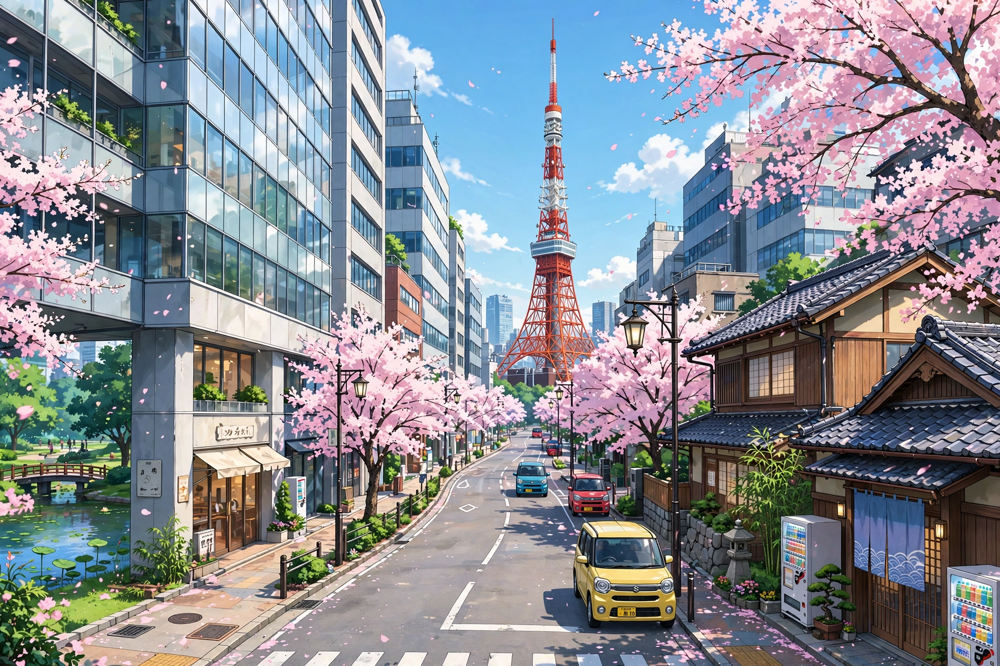

# CONCEPT — Tokyo 3D City

## Định hướng visual

Phong cách anime chân thật (Ghibli / Makoto Shinkai): màu sắc sinh động tươi mới, thu hút. Không neon, không cute low-poly.

## Layout

Map hình tròn 1km đường kính:
- **Trung tâm:** Tháp Tokyo + bùng binh
- **5 vành đai** (r = 80/160/240/320/400m)
- **12 đường xuyên tâm** tỏa đều
- **5 khu vực theo vành:**
  1. Văn phòng cao tầng (quanh tháp)
  2. Thương mại (siêu thị, cửa hàng)
  3. Dân cư (nhà phố, trường học)
  4. Công viên (cây xanh, hồ nước)
  5. Ven đô (nhà vườn, khu vui chơi)

## Reference images

### Sơ đồ tổng thể

### Phong cách đường phố

## Roadmap

- **Phase 1:** Base map tròn low-poly (hiện tại)
- **Phase 2:** Các khu vực chi tiết (siêu thị, trường học, hồ nước, khu vui chơi)
- **Phase 3:** Nâng cấp model, vạch kẻ đường, hiệu ứng
